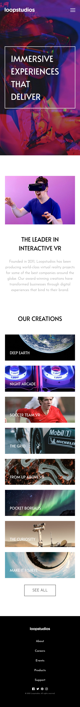

# Frontend Mentor - Loopstudios landing page solution

This is a solution to the [Loopstudios landing page challenge on Frontend Mentor](https://www.frontendmentor.io/challenges/loopstudios-landing-page-N88J5Onjw). Frontend Mentor challenges help you improve your coding skills by building realistic projects.

## Table of contents

- [Overview](#overview)
  - [The challenge](#the-challenge)
  - [Screenshot](#screenshot)
  - [Links](#links)
- [My process](#my-process)
  - [Built with](#built-with)
  - [What I learned](#what-i-learned)
  - [Continued development](#continued-development)
  - [Useful resources](#useful-resources)
- [Author](#author)
- [Daily summaries](#daily-summaries)

## Overview

### The challenge

Users should be able to:

- View the optimal layout for the site depending on their device's screen size (tablet and desktop)
- See hover states for all interactive elements on the page

### Screenshot

### Links

- URL: [https://florianstancioiu.github.io/loopstudios-landing-page/](https://florianstancioiu.github.io/loopstudios-landing-page/)
- Frontend Mentor URL: [https://www.frontendmentor.io/solutions/responsive-landing-page-with-vanilla-javascript-and-css-nesting-q79pRn0con](https://www.frontendmentor.io/solutions/responsive-landing-page-with-vanilla-javascript-and-css-nesting-q79pRn0con)

## My process

### Built with

- Semantic HTML5 markup
- CSS nesting
- CSS custom properties
- Flexbox
- CSS Grid
- Tablet-first workflow (because the free plan doesn't include a mobile design)
- Vanilla JavaScript

### What I learned

- I learned to use the `<picture>` element
- I learned to set each word from a paragrah on new line with CSS

### Continued development

I would take some time to create the mobile version of the challenge

### Useful resources

- [The Picture element](https://developer.mozilla.org/en-US/docs/Web/HTML/Reference/Elements/picture) - Helped me set different image versions for mobile and desktop
- [Can CSS force a line break after each word in an element?](https://stackoverflow.com/a/23889196/12159189) - Helped me set each word on a new line using plain CSS

## Author

- Frontend Mentor - [@florianstancioiu](https://www.frontendmentor.io/profile/florianstancioiu)
- Threads - [@florianstancioiu01](https://www.threads.com/@florianstancioiu01)
- LinkedIn - [florianstancioiu](https://www.linkedin.com/in/florian-stancioiu-765661349/)
- freeCodeCamp - [florianstancioiu](https://www.freecodecamp.org/florianstancioiu)

## Daily summaries

| Date                | Time Spent | Summary                                                                                           |
| ------------------- | ---------- | ------------------------------------------------------------------------------------------------- |
| February 15th, 2026 | 1.5 hours  | I worked on the tablet version of the challenge                                                   |
| February 28th, 2026 | 2 hours    | I worked on the tablet version of the menu and started to work on the desktop version of the page |
| March 29th, 2026    | 2 hours    | I worked on the hover states and fixed a bunch of errors the Frontend Mentor AI found             |

_Total time spent working on the project:_ **5.5 hours**
